# CACHING

## Cache Introduction

**1.1 Cache Introduction**

- A cache is a hardware or Software component that temporarily stores data
- Future requests for that data can be served faster
- The data in cache:
  - A copy of data from data source
  - The result of an earlier computation
- Cache is a shield for DB
- Trade-off
  - Performance vs Cost ( Space )
  - Performance vs Consistency ( sometime )

**1.2 Where is cache used**

- Cache used:
  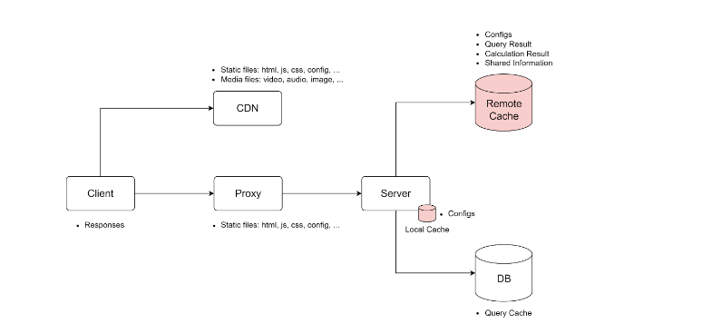

## Cach Strategies

**2.1 Read Strategies**

- Read Strategies:

  - Read-Through
  - **Read-Aside**

- Read-Aside

  - Pros:
    - Tolerate cache failures
    - Flexible for data models
  - Cons:

    - Complex for app
    - Data inconsistency

    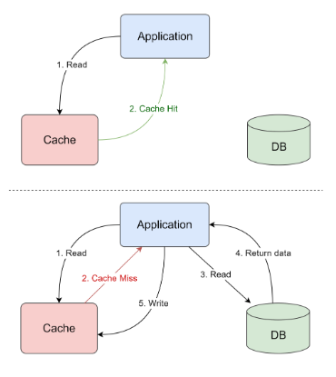

**2.2 Write Strategies**

- Write Strategies:

  - Write-Through
  - Write-Back
  - **Write-Around**

- Write-Around

  - **Invalid cache asynchronously**
  - Pros:
    - Decoupling cache and storage systems
  - Cons:

    - Inefficient for Frequently Accessed Data
    - Data inconsistency

    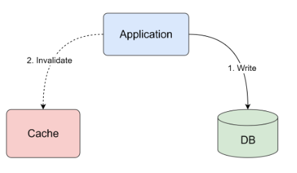

**2.3 Data inconsistency**

- The common problem: Data Inconsistency

- Solution: **Cache Invalidation**
- Cache Invalidation is removing data that is no longer valid or useful
- Types of Cache Invalidation:
  - **Time-based**
  - **Command-based**
  - **Event-based**
  - Group-based

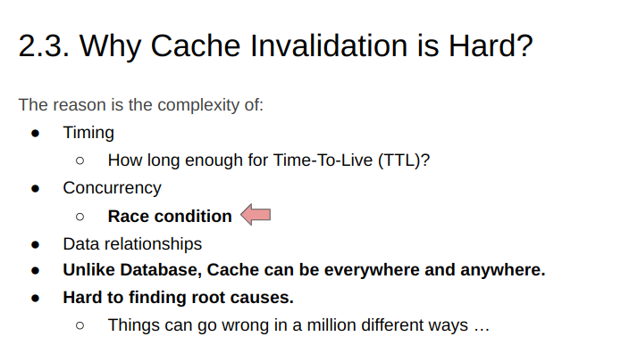

**2.4 Write-Around**

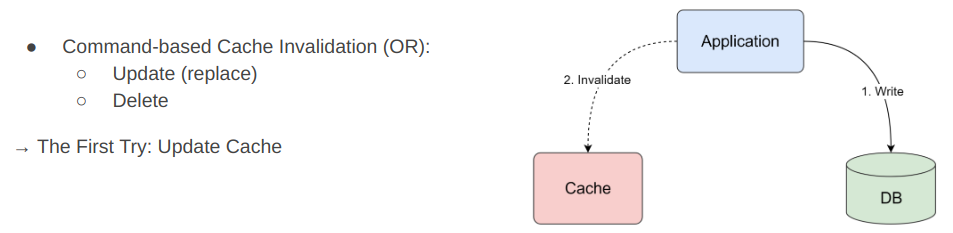

**2.5 The First Try: Update Cache**

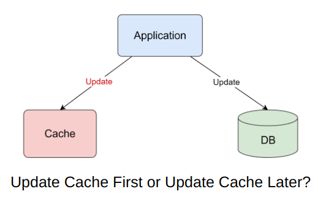

- Case 1: `Update cache first`
  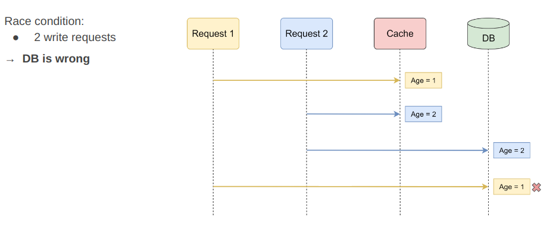

- Case 2: `Update cache later`
  

**2.6 The Second Try: Delete Cache**

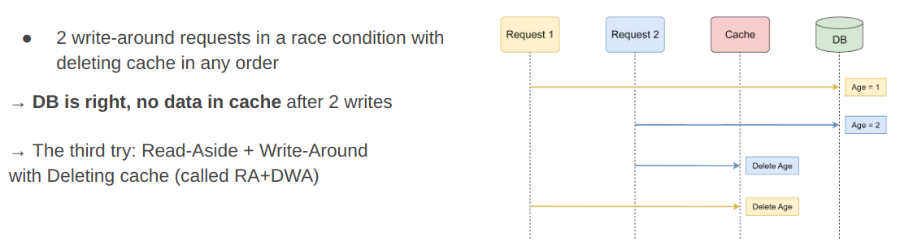

**2.7 The Third Try: Read Aside + Delete Write Around**

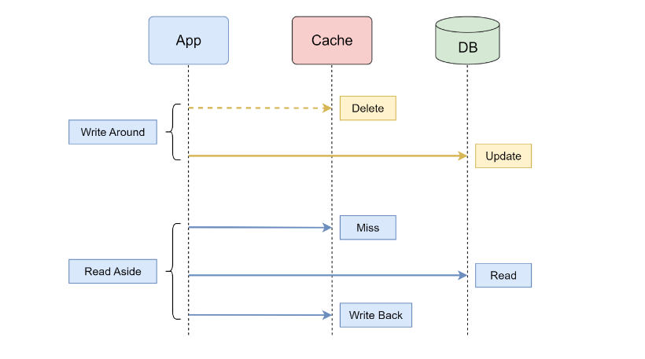

- Case 1: `Delete cache first`
  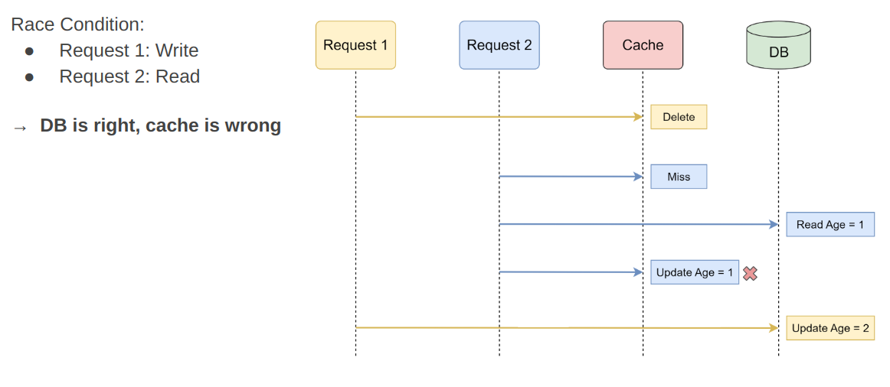

- Case 2: `Delete cache later`
  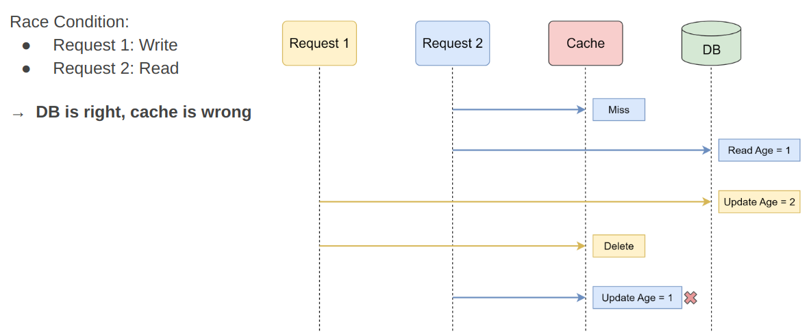

**Answer**

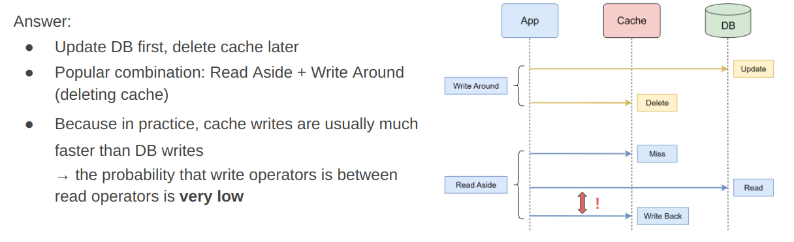

`How can we mitigate the impact?`

> Add **short TTL** to cache data

## Challenges

**3.1 Reliability Chalenges**

---

**_3.1.1 Problem 01: No Atomicity_**

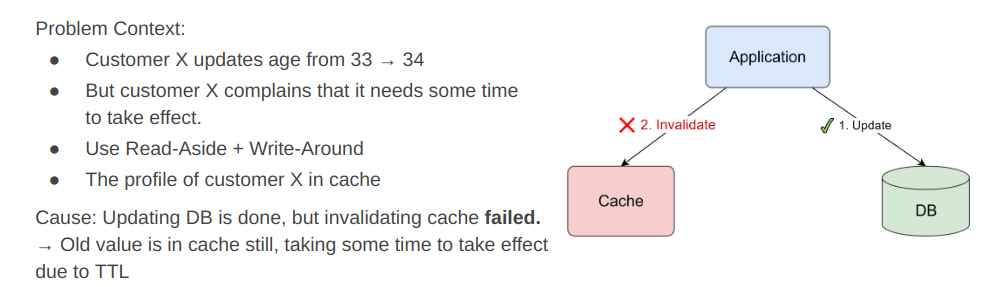

> Solutions :

> **Retry**

> Subscribe to binlog of DB

---

**_3.1.2 Problem 02: Cache Avalanche_**

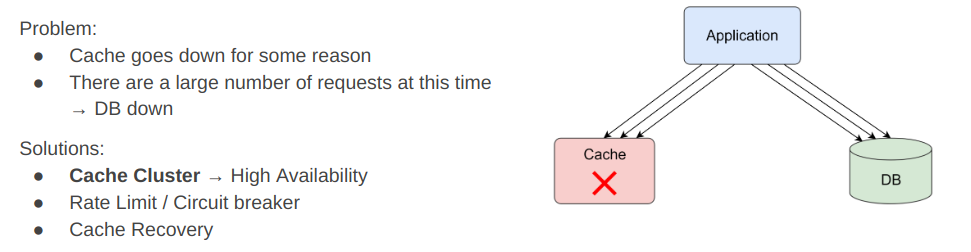

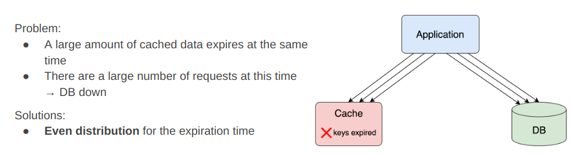

---

**_3.1.3 Problem 03: Cache Breakdown_**

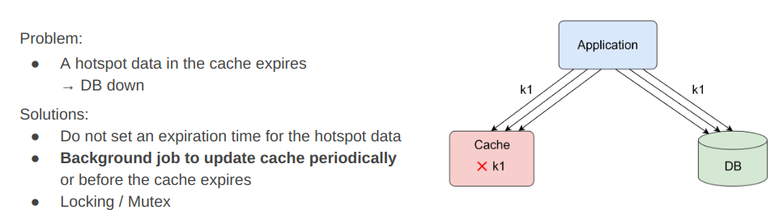

---

**_3.1.4 Problem 04: Cache Penetration_**

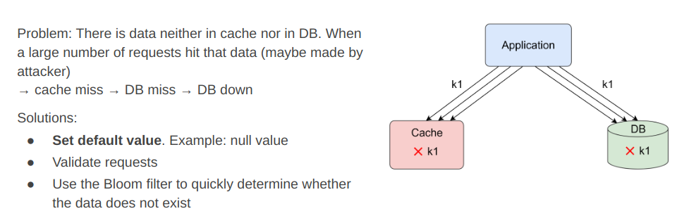

---

**3.2 High Traffic Challenges**

**_3.2.1 Problem 05: Hot keys_**

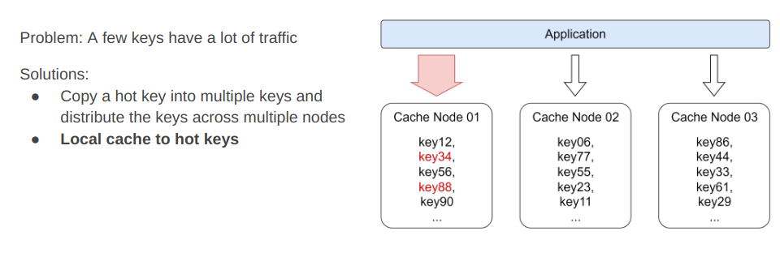

---

**_3.2.2 Problem 06: Large keys_**

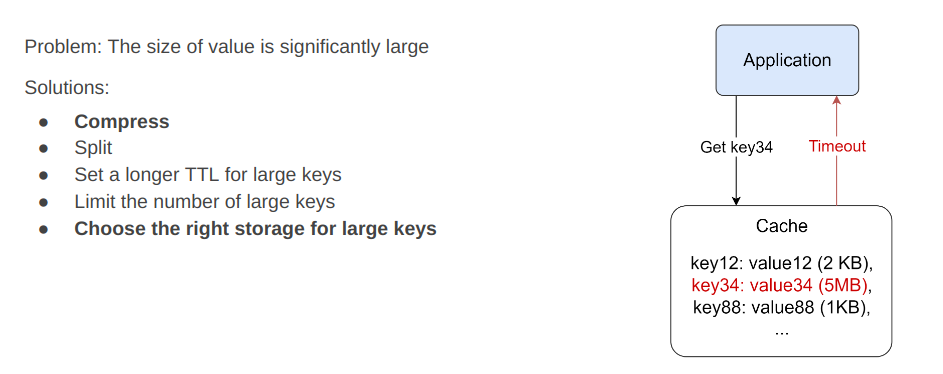

---

**3.3 Cache replacement**

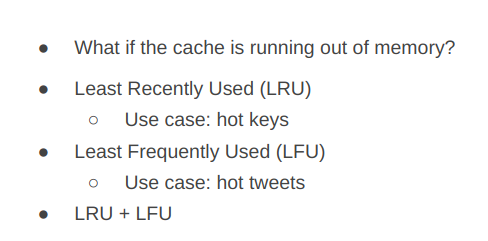

## Practice

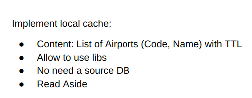
