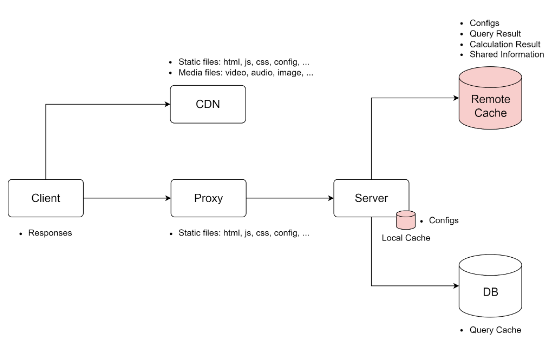

# CACHING

## Cache Introduction

**1.1 Cache Introduction**

- A cache is a hardware or Software component that temporarily stores data
- Future requests for that data can be served faster
- The data in cache:
  - A copy of data from data source
  - The result of an earlier computation
- Cache is a shield for DB
- Trade-off
  - Performance vs Cost ( Space )
  - Performance vs Consistency ( sometime )

**1.2 Where is cache used**

    

## Cach Strategies

**2.1 Read Strategies**

- Read Strategies:

  - Read-Through
  - **Read-Aside**

- Read-Aside

  - Pros:
    - Tolerate cache failures
    - Flexible for data models
  - Cons:

    - Complex for app
    - Data inconsistency

    
