# INDEX

## 1. INTRODUCTION

### 1.1. Index

- An index is a data structure that improves the speed of data retrieval operations
- Indexes are typically stored on disk

## 2. Classification

### 2.0. Classification

- `By data structure`: B+ tree index, Hash index, Fulltext (inverted) index, LSM Tree,...
- `By physical storage` : Clustered Index, Non-clustered Index (Secondary Index)
- `By number of columns` : Single-Column Index, Composite Index
- `By characteristics` : Primary Key Index, Unique Index, Prefix Index

### 2.1. Data Structure

**What factors should be considered when mentioning data structure and algorithm?**

- Use case
- `Time Complexity`
- `Space Complexity`
- Complexity of Implementation

#### 2.1.1. B-Tree (Balanced Tree)

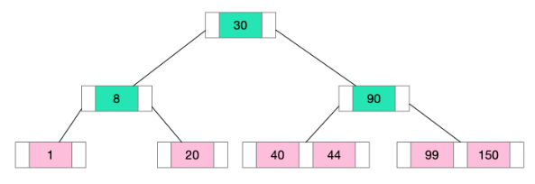

- **All leaves are at the same level**. Each node contains a **sorted list of keys**
- A non-leaf node with k children contains k-1 keys. This means if a node has three children (k=3), it will hold two keys (k-1)
- Insertion, deletion, and search operations can be performed in **O(LogN)** time

#### 2.1.2. B+Tree

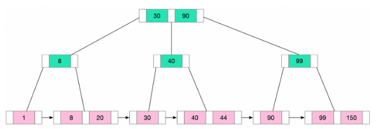

- The B+ Tree is a variant of the B-Tree
- The pointers to the actual records are stored only at the leaf nodes
- The internal nodes only contain keys and pointers to other nodes. **Many keys can be stored in internal nodes**
  - **Reducing the overall height of the tree**
  - Decreases the number of disk accesses
- **All leaf nodes are linked together in a linked list => efficient for range queries**

#### 2.1.3. B-Tree vs B+Tree

`read more...`
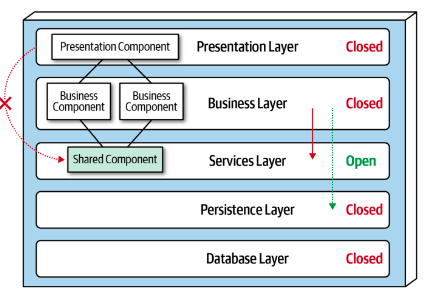

#### 2.1.4. Hash Index

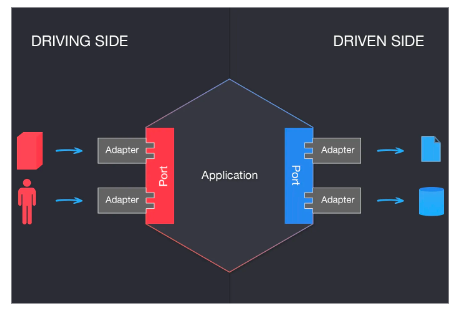

- Hash Index usses a hash function to map keys to specific locations
- Hash index well-suited for **equality comparisons**, such as "=" .
- **Limitations:**
  - **Range-based queries, sorting**
  - Collision

### 2.2. Physical Storage Index

#### 2.2.1. Clustered Index

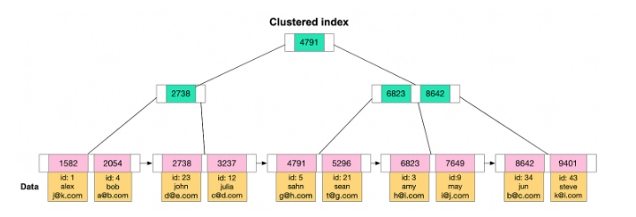

- Clustered Index is a type of index that determines the **physical order of the data in a table**.
- The **leaf nodes** of the B+Tree off the clustered index store **acutal data**
- A table can have only one clustered index
- **By default, primary key is used for clustered index**. But we can choose different column(s) for the clustered index, separate from the primary key.

#### 2.2.2. Non-Clustered Index

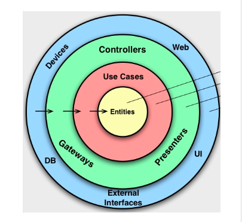

- Indexes are not clustered index, then non-clustered (secondary) indexes.
- **The value** (the leaf node of B+ Tree) of secondary index is **the primary key value**
- A table can have multiple secondary indexes
- Accessing data using a secondary index involves at least **two disk reads**. One to access the secondary index and another to access the clustered index to get actual data.

`What are disadvantages of indexes?`

- **Slowing down write operations**
- **Occupying physical space**
- It takes time to create and maintain indexes

`Why leaf node of secondary index point to the primary key value, not the disk address?`

→ The disk address of records might be change during table operating, defragment,..

### 2.3 Characteristics

#### 2.3.1 Characteristics

`What is diference between key & index ?`

- **Key means a constraint** imposed on the behaviour of the column.
  - Ex: primary key is non nullable field which uniquely identifies each row
- **Index** is a special data structure that **facilitates data search** across the table.

#### 2.3.2 Primary Index

- Primary Index is a specific type of index that serves as a **unique identifier for each row in a table**.
- If the key is **sequential**, writing to the table is generally **efficient**

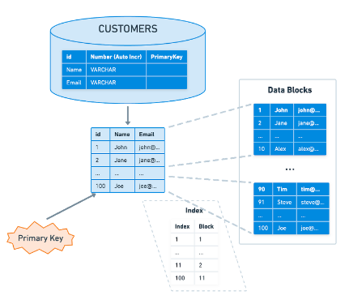

#### 2.3.3. Unique Index

- The value of the index column must be unique, but null values ​​are allowed.
- Command:

```sql
CREATE UNIQUE INDEX index_name ON table_name(index_column_1,index_column_2, ...);
```

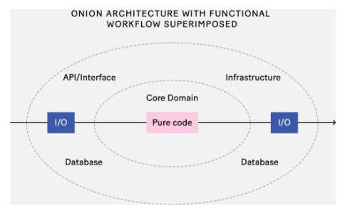

### 2.4. Number Of Columns

#### 2.4.1. Composite Index

- Composite Index is a multi-column index.
- **The more columns in a composite index**
- **The more storage space in used**

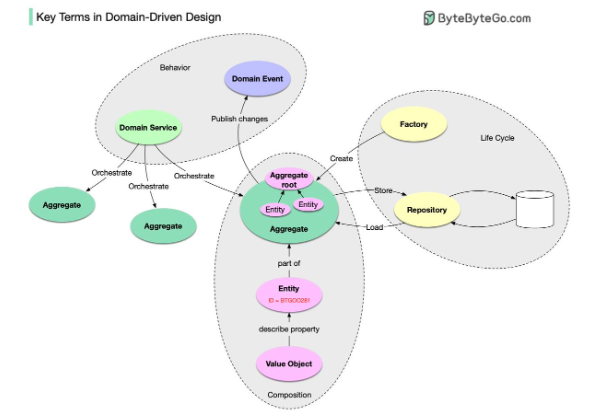

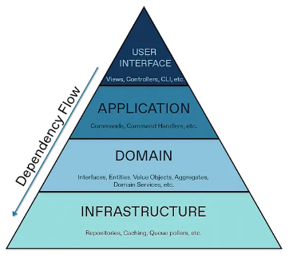

`Composite index: (country, provine, name). Which one uses index?`

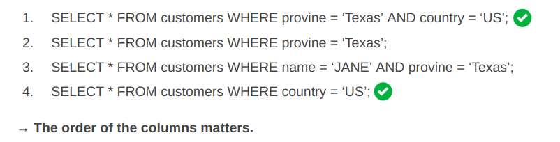

---

`Is composite index (country, provine, name) effective?`

`How do we determine the order in a composite index?`

- Approach: **Columns with high cardinality (the high number of distinct values) first.**
  → The B+Tree has more branches → Node has less keys
  → Time complexity decreases

Example: Composite index: (name, provine, country)

---

- Composite Index (a, b)

```sql
Q1: SELECT * FROM table WHERE a > 1 AND b = 2
Q2: SELECT * FROM table WHERE a >= 1 AND b = 2
Q3: SELECT * FROM table WHERE a BETWEEN 2 AND 8 AND b = 2
```

- Question:
  `Does each query use the index?`
  `How many columns are used? `

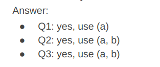

#### 2.4.2. Covering Index

- A covering index is an index that **contains all the columns in the SELECT**
- Answering the query by using the index alone, reducing disk I/O operations
  → improve the performance significantly
- Recommended: =< 5 columns

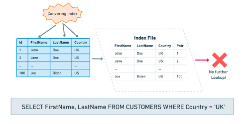

### 2.5. Other Indexes

- Classified by data structure:
  - Fulltext Index (Inverted index)
  - Spatial Index: GIST (Postgres)
  - Bitmap Index:
    - Use case: Read heavy on counting low-cardinality column.
    - Example: Count the number of orders in PROCESSING status.

## 3. Practices

### 3.1. Indexes in Use

`When to use indexes?`

- Frequent queries with WHERE, JOIN, GROUP BY, ORDER BY
- **Find small set of records**
- Fields with unique restrictions, such as product_id

`When to not use indexes?`

- Table has too little data
- Very low cardinality. For example: gender
- Only write heavy, no read much

### 3.2 Use case Index (các trường hợp ăn index)

#### 3.2.1. Index Failure 01

`Index on ‘name’ column`

```SQL
SELECT * FROM users WHERE name LIKE ‘%ronin’;
SELECT * FROM users WHERE name LIKE ‘%ronin%’;
SELECT * FROM users WHERE name LIKE ‘ronin%’; (choose)
```

#### 3.2.2. Index Failure 02

`Index on ‘id’ column`

```sql
SELECT * FROM users WHERE id = 1 OR age = 18; (not choose)
```

#### 3.2.3. Index Failure 03

1. Column ‘id’: int

```sql
SELECT * FROM users WHERE id = ‘10’; (choose)
```

2. Column ‘id’: varchar

```sql
SELECT * FROM users WHERE id = 10
```

Because automatically convert the string to a number, and then compare it

#### 3.2.4. Index Failure 04

Index on column ‘name’

```sql
SELECT * FROM users WHERE length(name) = 6;
```

→ Because the index saves the original value of the index field,
**not the value calculated by the function.**
Oracle, Postgres, MySQL 8.0+ support function index, but be careful with it!

#### 3.2.5. Index Failure 05

Index on ‘id’ column:

```sql
SELECT * FROM users WHERE id + 1 = 10;
SELECT * FROM users WHERE id + 0 = 10 - 1;
```

→ Because the index saves the original value of the index field,
**not the value calculated by expressions**

### 3.3. Best Practices

- Limit the Number of Indexes
- The primary key index is preferably self-incrementing
  - No need to move the existing data
  - Reduce page split, fragmentation
- The index is best set to NOT NULL
  - Value comparison more complicated
  - NULL value is a meaningless value, but it will occupy physical space
- Covering Index
  - Reduce a lot of I/O operations
- Prefix index
  - Reduce the size of the index storage
- Regularly Monitor and Optimize the Indexes
  - B+ Tree might become imbalance overtime → rebuild index
- Prevent index failures

## Recap

- All leaf nodes are linked together in a linked list → efficient for range queries
- Accessing data using a secondary index involves at least two disk reads. One to access the secondary index and another to access the clustered index to get actual data.
- Leverage composite index, covering index. And high cardinality first.

## HW

[data setup](https://docs.google.com/document/d/1wEXF0DQ0kasxHJ57uAyf3B4vgk4WXw9P1RilH9yz-OE/edit#heading=h.1cyg1infzvkx)

Theory statement
SQL(s)
Result, explain
