# REST API DESIGN

## Mindset

**1.1 Why Design first?**

- Think how it works at high level

  > Cover almost cases

  > Reduce resources

- Better coordition among other teams
- Good designs make you a good engineer, a potential employee

**1.2 Mindset**

- Scalable ( Khả năng mở rộng )
- Consistency ( Tính thống nhất )
- Inspect every single aspect ( Kiểm tra mọi khía cạnh )
- No one fits all (Trade-offs)

## REST Conventions

**2.1 HTTP Methods**

**_Properties:_**

- Safety: do not alter the server state/data
- Idempotency: a same request is sent once or multiple times, the response is the same.

**_Operations:_**

- Create: `POST`
- Read: `GET`
- Update Totally: `PUT` ( Cập nhật toàn phần)
- Delete: `DELETE`
- Update Partically: `PATCH` (Cập nhật một phần)

| HTTP Method | Safe | Idempotent |
| :---------- | :--- | :--------- |
| GET         | YES  | YES        |
| HEAD        | YES  | YES        |
| OPTIONS     | YES  | YES        |
| TRACE       | YES  | YES        |
| PUT         | NO   | YES        |
| DELETE      | NO   | YES        |
| POST        | NO   | NO         |
| PATCH       | NO   | NO         |

**2.2 RESTful API Conventions**

- Use Nouns Instead of Verbs ( Dùng danh từ không dùng động từ )
- Plural Nouns ( Dùng danh từ số nhiều )
- Use Nesting to Show Relationships
- Versioning
- Slug-case for URL
- Snake_case for request, response body

**_Example_** : `https://software-development.com/api/v1/posts/<post_id>/comments`

**_Practice_** :
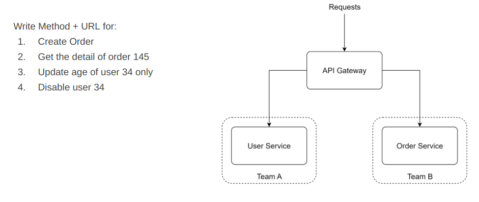
**_Solutions_**: 
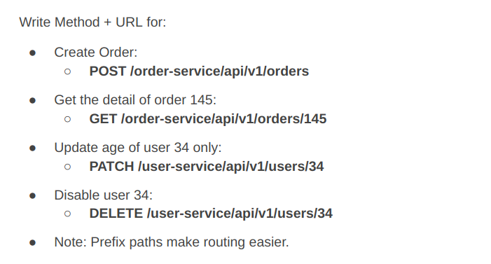

**2.4 Pagination**

- Page, size parameters:

  > Expample: `GET /users?page=0&size=10`

  > Use case: management portal

  > Must document: Page start counting with 0 or 1

- Offset, limit parameters:

  > Example: `GET /users?offset=0&limit=10`

  > Use case: a infinite scrollable list, newsfeed, logging events...

- _Issue_ : `SELECT * FROM users OFFSET 100 LIMIT 10 ?`

- _Problem_ :
  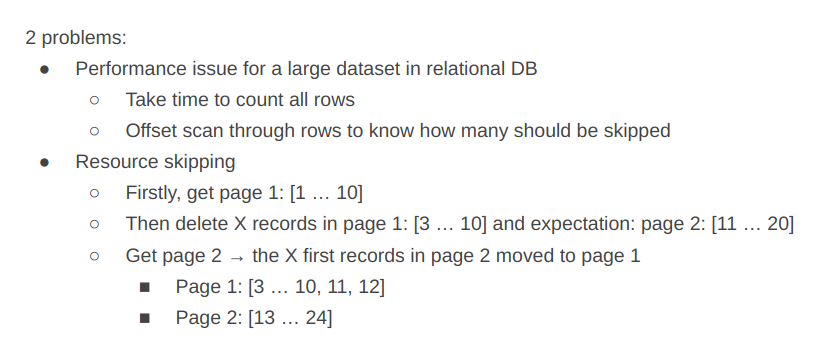

- _Solutions_ :
  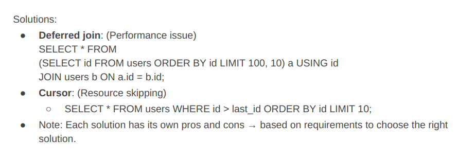

**2.5 Sorting**

- `GET /products?sort=price:asc,name:desc`

- `GET /products?sort=+price,-name,+title,..`

**2.6 Relations**

- One-to-Many :

  - Get all comments of an article 123

  > `GET/articles/123/comments`

- Many-to-Many :

  - Get students in a class

  > `GET/classes/<class_id>/students`

  ***

  - Add a student into a class

  > `POST/classes/<class_id>/students/<student_id>`

  - Note: Using Put because of idempotency

  ***

  - Add students into a class

  > `POST/classes/<class_id>/students`

## Case Studies

**Problem 01**
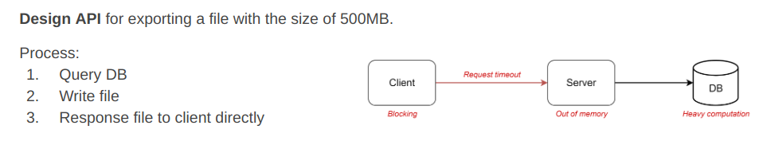

- **_Issue_**

  > `Client is blocked` : Nghĩa là khi client gửi request lên backend nó phải đợi các response trả về thì nó mới thực hiện các công việc tiếp theo
  > `Request timeout` : Các file có thể sẽ xử lý lâu nên kết nối giữa client và backend nó có thể sẽ bị timeout
  > `Out of memory` > `Heavy computation, Large result of the query`

- **_Solutions_**

  - **_POLLING ( ASYNC API)_**
    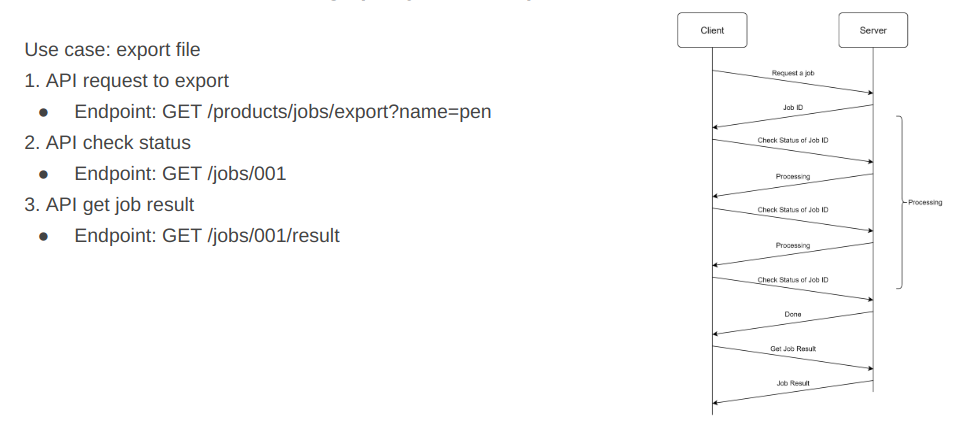
    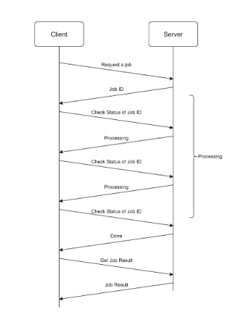
    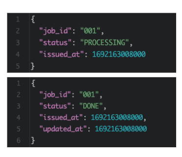

    > 2 response trên là của 2 api đầu tiên

  ***

  - **_CALLBACK_**

    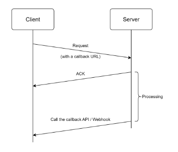

- **_TYPE OF ASYNC API_**

  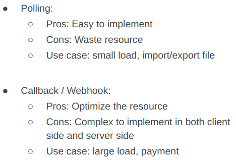

---

**Problem 02**

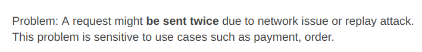

- **_Solutions_**

  - Clients generates and adds an **Idempotency Key** to the request header.
    > Idempotency có thể sinh ra ở server
  - Server checks **Idempotency Key** with **Unique Contraint in DB**

  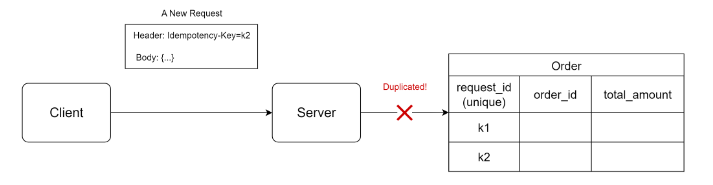

## Rest API Document

**4.1 API Doc**

- Resources:
  - [REST API DOC](https://docs.google.com/document/d/1hrxXSy2te4D37CL_jrN68u6lS-Errnq7Stk9CeDXnTs/edit)
    > Note: Ở phần description api sẽ description nó có nhiệm vụ gì và ai thực hiện api đó.
  - [REST API MAP](https://docs.google.com/spreadsheets/d/1e6O9mRXYjy2oMGDv8PepC5ASKy3qv8XnIucK4r8NUIo/edit?gid=0#gid=0)

## Practice

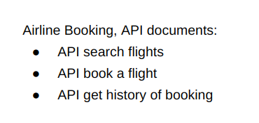

Demo: [Airline-Booking-API](https://docs.google.com/spreadsheets/d/1-BXyTF-OCxLmLr9y7Dq9T4PKLLHicQv3ncsLgdd7C9c/edit?gid=1420851941#gid=1420851941)
